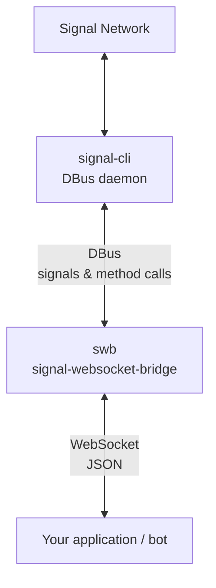

# Signal WebSocket Bridge

A WebSocket bridge for [signal-cli](https://github.com/AsamK/signal-cli) that provides real-time, push-based access to Signal messages via DBus. Unlike signal-cli's built-in JSON-RPC server, this bridge uses the DBus interface to deliver messages instantly without polling, while still allowing you to send messages through a simple JSON request/response interface.

## Architecture



Incoming messages are pushed to all connected WebSocket clients the moment signal-cli fires a DBus signal - no polling involved.

## Docker

A ready-to-use Docker image is available on GitHub Container Registry. The image includes:

- **Python 3.13** with the WebSocket bridge
- **signal-cli (official upstream release archive)**
- **DBus** for communication between components

### Supported platforms

- `linux/amd64` (x86_64)
- `linux/arm/v7` (ARMv7 - Raspberry Pi 2/3)
- `linux/arm64/v8` (ARM64 - Raspberry Pi 4, Apple Silicon)

The Docker release workflow checks the latest upstream `AsamK/signal-cli`
release daily and rebuilds/publishes images automatically with that version.

### Quick start

#### 1. Create a `docker-compose.yml`

```yaml
services:
  signal-bridge:
    image: ghcr.io/smeinecke/signal-websocket-bridge:latest
    environment:
      - SIGNAL_WS_HOST=0.0.0.0
      - SIGNAL_WS_PORT=8765
      - SIGNAL_DBUS_BUS=session
      - SIGNAL_WS_TOKEN=your-secret-token   # required when exposed beyond localhost
      - SIGNAL_LOG_LEVEL=INFO
    volumes:
      - signal-cli-data:/var/lib/signal-cli
    ports:
      - "8765:8765"

volumes:
  signal-cli-data:
```

#### 2. Start the container

```bash
docker compose up -d
```

#### 3. Register or link your Signal account

**Option A: Register a new phone number**
```bash
# Replace +4915... with your actual phone number
docker compose exec signal-bridge signal-cli -a +4915... --config /var/lib/signal-cli register

# Verify with the code received via SMS/voice call
docker compose exec signal-bridge signal-cli -a +4915... --config /var/lib/signal-cli verify 123456
```

**Option B: Link to an existing Signal device** (recommended for most users)
```bash
# Generate a linking URI (shows as QR code data)
docker compose exec signal-bridge signal-cli --config /var/lib/signal-cli link

# Or output as URL for manual linking
docker compose exec signal-bridge signal-cli --config /var/lib/signal-cli link --uri
```

Then scan the QR code with your Signal mobile app: **Settings → Linked Devices → Link New Device**.

#### 4. Test the WebSocket connection

```bash
# Using websocat (install with: cargo install websocat)
websocat ws://localhost:8765/ws

# Or using curl for the health endpoint
curl http://localhost:8765/health
```

**With authentication enabled:**
```bash
# Send auth as first message
websocat ws://localhost:8765/ws
{"auth": "your-secret-token"}
# Wait for {"auth": "ok"} response, then:
{"id": 1, "method": "listGroups"}
```

#### 5. Send a test message

```bash
# Via WebSocket
echo '{"id": 1, "method": "sendMessage", "params": {"message": "Hello from Docker!", "recipients": ["+4915..."]}}' | websocat ws://localhost:8765/ws
```

**Full walkthrough:** See [CLIENT_EXAMPLES.md](CLIENT_EXAMPLES.md) for complete code examples in Python and JavaScript.

### Building locally

```bash
# Clone the repository
git clone https://github.com/smeinecke/signal-websocket-bridge.git
cd signal-websocket-bridge

# Build the image
make docker-build

# Or manually
docker build -t signal-websocket-bridge:local .
```

### Base images

- **Builder & Runtime**: `debian:testing-slim`
- **signal-cli source**: upstream release tarball from `AsamK/signal-cli`
- **Java**: `default-jre-headless` (OpenJDK from Debian repos)

## Prerequisites (non-Docker)

### 1. System packages (cannot be installed via pip)

```bash
# Debian / Ubuntu
sudo apt install python3-dbus python3-gi

# Arch
sudo pacman -S python-dbus python-gobject
```

### 2. Python dependencies

```bash
uv sync
```

### 3. signal-cli running in DBus daemon mode

signal-cli must be started as a DBus service so that `org.asamk.Signal` is available on the bus:

```bash
# Register your account first (one-time)
signal-cli -a +49... register
signal-cli -a +49... verify <code>

# Start the DBus daemon
signal-cli -a +49... daemon --system
```

For autostart, install the provided `signal-cli.service` systemd unit.

## Running the bridge

```bash
# Default: system bus, localhost:8765
swb-bridge
# or: python -m swb

# Session bus (per-user signal-cli install)
swb-bridge --session

# Custom host/port with auth token
swb-bridge --host 0.0.0.0 --port 9000 --token mysecret

# Multi-account mode (signal-cli running with multiple accounts)
swb-bridge --account +4915...
```

### Environment variables

All flags can also be set via environment variables:

| Variable | Flag | Default | Description |
|----------|------|---------|-------------|
| `SIGNAL_DBUS_BUS` | `--system` / `--session` | `system` | DBus bus to connect to (`session` in Docker image/compose defaults) |
| `SIGNAL_WS_HOST` | `--host` | `localhost` | WebSocket listen address |
| `SIGNAL_WS_PORT` | `--port` | `8765` | WebSocket listen port |
| `SIGNAL_WS_TOKEN` | `--token` | _(none)_ | Auth token - required if exposed beyond localhost |
| `SIGNAL_ACCOUNT` | `--account` | _(none)_ | Phone number for multi-account mode (e.g. `+4915...`) |
| `SIGNAL_LOG_LEVEL` | `--log-level` | `INFO` | Log level: `DEBUG`, `INFO`, `WARNING`, `ERROR` |

> **System vs session bus**: signal-cli started as a systemd service or with `--system`
> uses the system bus. A user-level install uses the session bus. When in doubt:
> ```bash
> dbus-send --system --print-reply --dest=org.asamk.Signal /org/asamk/Signal \
>   org.freedesktop.DBus.Introspectable.Introspect
> # if that fails, try --session
> ```

## HTTP endpoints

| Endpoint | Method | Description |
|----------|--------|-------------|
| `/ws` | `GET` (WS upgrade) | WebSocket endpoint |
| `/` | `GET` (WS upgrade) | Alias for `/ws` |
| `/health` | `GET` | Liveness/readiness probe |
| `/asyncapi.json` | `GET` | Auto-generated AsyncAPI 2.6 spec (JSON) |
| `/asyncapi.yaml` | `GET` | Auto-generated AsyncAPI 2.6 spec (YAML) |

### `/health`

Returns `200 OK` when connected to the signal-cli DBus service, `503 Service Unavailable` while reconnecting.

```bash
curl http://localhost:8765/health
# {"status": "ok"}

# Use as Docker HEALTHCHECK or Kubernetes readiness probe
```

### `/asyncapi.json` / `/asyncapi.yaml`

Returns a live AsyncAPI 2.6 specification generated from DBus introspection. Includes all available methods and signal schemas. Refreshes automatically after a reconnect.

## WebSocket protocol

### Authentication

When `--token` / `SIGNAL_WS_TOKEN` is set, the first message from the client must be an auth message. The connection is closed if authentication fails or doesn't arrive within 5 seconds.

```json
// Client → server (first message)
{"auth": "your-secret-token"}

// Server → client (on success)
{"auth": "ok"}

// Server → client (on failure)
{"error": "unauthorized"}
```

### Bridge events (server → client, push)

The bridge emits system events when the DBus connection state changes:

```json
{"signal": "Disconnected"}   // signal-cli went away
{"signal": "Reconnected"}    // bridge reconnected to signal-cli
```

### Incoming Signal messages (server → client, push)

Known signals are delivered with **named fields**. Unknown or future signals fall back to a generic `{signal, args[]}` format.

#### `MessageReceived`

Fired when a direct or group message arrives.

```json
{
  "signal": "MessageReceived",
  "timestamp": 1713000000000,
  "sender": "+4915100000000",
  "groupId": null,
  "message": "Hello!",
  "attachments": []
}
```

`groupId` is a base64 string for group messages, `null` for direct messages.

#### `SyncMessageReceived`

Fired when *you* send a message from a linked device.

```json
{
  "signal": "SyncMessageReceived",
  "timestamp": 1713000000000,
  "sender": "+4915100000000",
  "destination": "+4916200000000",
  "groupId": null,
  "message": "Hello from my phone",
  "attachments": []
}
```

#### `ReceiptReceived`

Fired when a recipient's device delivers your message.

```json
{
  "signal": "ReceiptReceived",
  "timestamp": 1713000000000,
  "sender": "+4915100000000"
}
```

### Sending messages (client → server, request/response)

All requests use a simple JSON format with `id`, `method`, and `params` fields. The `id` field is echoed back in the response.

#### Send a 1:1 message

```json
{"id": 1, "method": "sendMessage", "params": {"message": "Hello!", "recipients": ["+4915100000000"]}}
```

Response:
```json
{"id": 1, "result": {"timestamp": 1713000000000}}
```

#### Send a group message

`groupId` is the base64-encoded group ID from `listGroups`.

```json
{"id": 2, "method": "sendGroupMessage", "params": {"message": "Hello group!", "groupId": "abc123=="}}
```

#### With attachments

```json
{
  "id": 3,
  "method": "sendMessage",
  "params": {
    "message": "See attached",
    "recipients": ["+4915100000000"],
    "attachments": ["/var/lib/signal-cli/attachments/photo.jpg"]
  }
}
```

### Full method reference

See [METHODS.md](METHODS.md) for the complete method reference including:

- **Messaging** - `sendMessage`, `sendGroupMessage`, `sendMessageReaction`, etc.
- **Groups** - `createGroup`, `listGroups`, `joinGroup`, etc.
- **Group Management** - `quitGroup`, `addGroupMembers`, `addGroupAdmins`, etc.
- **Contacts** - `getContactName`, `setContactName`, `isContactBlocked`, etc.
- **Profile** - `updateProfile`
- **Devices** - `addDevice`, `listDevices`, `sendSyncRequest`
- **Identity** - `listIdentities`, `trustIdentity`
- **Misc** - `version`, `uploadStickerPack`

## Client examples

See [CLIENT_EXAMPLES.md](CLIENT_EXAMPLES.md) for complete examples in:

- **Python (asyncio)** - Basic connection, authentication, and message handling
- **JavaScript (Node.js / browser)** - Browser-compatible WebSocket client
- **Simple echo bot** - Replies to every message with an echo
